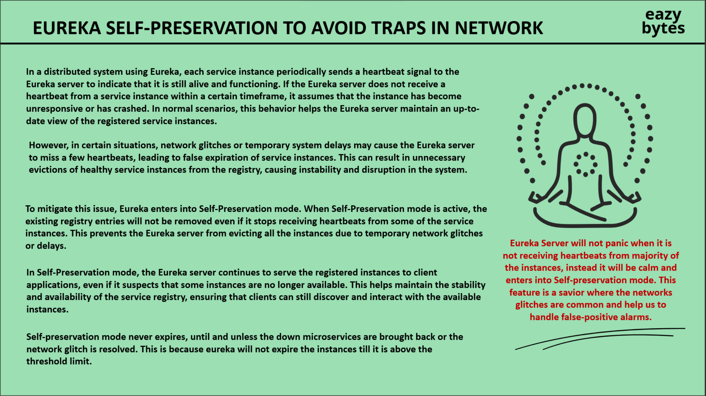
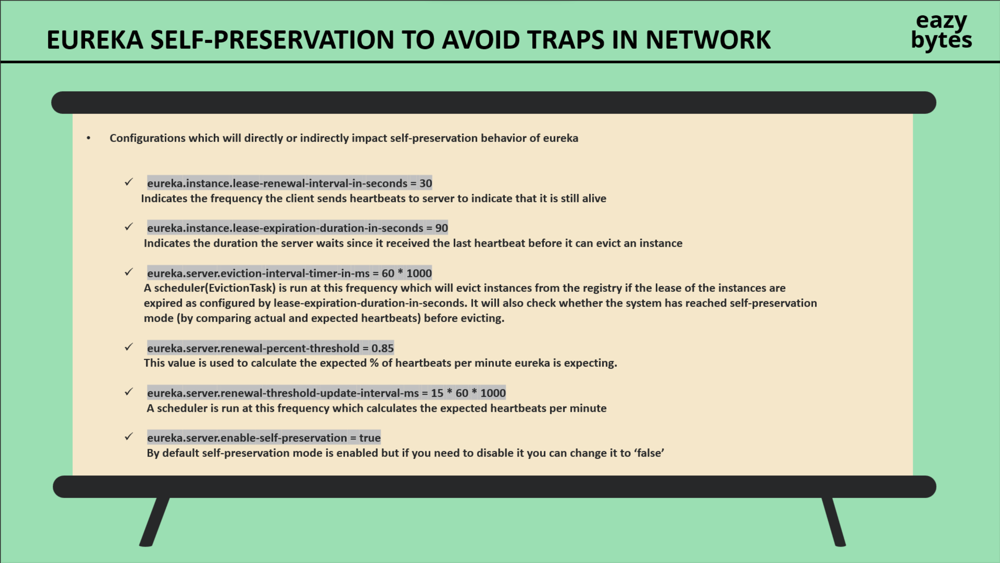

===================== EUREKA SELF-PRESERVATION MODE =====================

1. Khi một service bị down thì Eureka sẽ không thể nhận được thông tin heartbeats này từ service đó. Do đó, Eureka sẽ không thể xóa service này ra khỏi danh sách các service đang hoạt động ngay lập tức. Bởi vì nó cần phải đảm bảo rằng vẫn tồn tại các registered instances có sẵn trong Service Registry để tránh gây ra các exceptions trong quá trình hoạt động của toàn bộ hệ thống.
2. Khi đó, Eureka sẽ đưa service này vào trạng thái "down" và sẽ không cho phép các client khác gọi tới service này nữa. Tuy nhiên, Eureka vẫn sẽ giữ lại thông tin của service này trong danh sách các service đang hoạt động trong một khoảng thời gian nhất định (thời gian này được cấu hình trong Eureka Server).
3. Nếu tới hạn thời gian của EvictionTask. Thì Eureka Server sẽ kiểm tra xem hệ thống có đang ở trạng thái "self-preservation" hay không. Nếu có thì Eureka Server sẽ không xóa service này ra khỏi danh sách các service đang hoạt động. Ngược lại, nếu không thì Eureka Server sẽ xóa service này ra khỏi danh sách các service đang hoạt động.

===================== Cơ chế Authentication của ứng dụng. =====================
1. Khi người dùng thực hiện đăng nhập vào ứng dụng thì nếu thành công:
   - Auth service sẽ lưu acess token vào trong Redis với thời gian sống tương ứng.
   - Sau này, API Gateway sẽ verify access token này thông qua việc tìm trong Redis.
   - Auth service sẽ gửi về cho client access token và refresh token.
   - Client sẽ lưu lại access token và refresh token vào local storage.
2. Khi người dùng thực hiện một request hợp lệ (public page hoặc chứa token hợp lệ) thì API Gateway sẽ verify thông qua việc tim, và chuyển xuống các service tương ứng.
3. Khi người dùng thực hiện một request chứa access token hết hạn:
   - Ban đầu, API Gateway sẽ lấy access token này trong header. Sau đó, nó sẽ tìm trong Redis xem access token này có
     tồn tại hay không. Và do token đã hết hạn nên không tìm thấy. API Gateway sẽ trả về mã lỗi 498 cho Client.
   - Client sẽ nhận được mã lỗi 498 và sẽ thực hiện gọi tới Auth service để lấy lại access token mới thông qua refresh token.
   - Auth service sẽ kiểm tra xem refresh token này có hợp lệ hay không. Nếu hợp lệ thì Auth service sẽ tạo ra một access token mới và gửi về cho Client. Đồng thời cũng sẽ lưu access token mới này vào Redis với thời gian sống tương ứng.
   - Client sẽ nhận được access token mới và sẽ thực hiện lại request tới API Gateway với access token mới này.
   - API Gateway sẽ tìm access token này trong Redis và thấy rằng nó đã tồn tại. Do đó, API Gateway sẽ chuyển request
     xuống các service tương ứng.
   - Trong trường hợp refresh token cũng đã hết hạn thì Auth service sẽ trả về mã lỗi 499 cho Client. Client sẽ phải thực hiện lại
     quá trình đăng nhập để lấy lại access token và refresh token mới.

===================== Docker compose file =====================

1. Chú ý quan trọng rằng, đối với các service của spring boot thì phải đưa về port mặc định là 8080, sau đó expose ra
   8080 trong Dockerfile và cuối cùng mới là mapping về port phù hợp trong docker-compose.yml.
    - Mục tiêu cho điều này là đồng bộ lại các internal port trong container của spring boot app.
    - Việc chúng ta expose nó giống như việc chúng ta sẽ lựa chọn các port tồn tại bên trong container và cho phép port
      nào sẽ được tiếp xúc ra bên ngoài
    - Nếu chúng ta expose ra các port mà không có trong danh sách các interal port của container thì chắc chắc việc
      mapping cũng sẽ không chính xác.
    - Ví dụ:
        - server.port=8080
        - EXPOSE 8081
        - ports:
            - "8081:8081"
              -> Với ví dụ trên thì khi mà client truy cập vào host machine với port 8081 thì sẽ không thể truy cập được
              vào trong ứng dụng vì port 8081 không tồn tại trong container hoặc nếu tồn tại thì sẽ là của một ứng dụng
              khác chứ không phải là ứng dụng mà ta mong muốn.

===================== Spring WebSocket =====================

1. Trong các hệ thống có sử dụng WebSocket và External Broker thì về cơ bản sẽ có 2 phần.
    - Phần 1: Là phần server sẽ tạo ra một WebSocket server để lắng nghe các kết nối từ client.
    - Phần 2: Là phần WebSocket server sẽ kết nối tới một external broker như RabbitMQ, ActiveMQ, Kafka, ... để gửi và
      nhận các message từ client.
2. Bởi vì các hệ thống trên có 2 phần chính, do đó ở mỗi phần chúng ta có thể sử dụng các giao thức(protocol) khác nhau
   để thực hiện kết nối cũng như trao đổi message:
    - Phần 1: Sử dụng giao thức WebSocket(SockJS || STOMP) để kết nối và trao đổi message giữa Client và WebSocket
      Server.
    - Phần 2: Có thể sử dụng AMQP, MQTT, STOMP, ... để kết nối và trao đổi message giữa WebSocket Server và External
      Broker.
3. LUỒNG HOẠT ĐỘNG CỦA 1 HỆ THỐNG WEBSOCKET NHƯ SAU:

   _**1. Message Flow to RabbitMQ:**_
    - Khi WebSocket Server nhận được message từ phía Client, nó sẽ xử lý, và nếu sử dụng AMQP thì sẽ gửi message đó tới
      exchange của RabbitMQ.

   _**2. RabbitMQ Internal Routing:**_
    - Exchange sẽ route message đó tới queue phù hợp dựa trên routing key.

   _**3. Return Path to Clients:**_
    - Khi có một client thực hiện _.subcribe()_ tới WebSocket Server(lưu ý rằng client không biết gì về RabbitMQ nên
      phải thực hiện subcribe gián tiếp qua WebSocket Server), WebSocket Server sẽ tạo ra một Subcription tương ứng tới
      một queue trong RabbitMQ.
    - WebSocket Server sau đó sẽ forward message có trong các queue tới cho subscription tương ứng.

   _**4. Message Conversion:**_
    - Sau khi message chuyển tới Subcription tương ứng thì lúc này sẽ sử dụng _**MessageConverter**_ bean đã khởi tạo
      trọng RabbitMQConfiguration file để _convert phần body của message từ byte[] sang Object_.
      _**- Cuối cùng là chuyển về cho Client thông qua WebSocket Server và thông qua STOMP.**_

===================== Triển khai WebSocket lên Droplet environment. =====================

server {

    server_name 165.22.244.209 moviereservation.software www.moviereservation.software; 
    location /api-docs/ {
        proxy_pass http://localhost:8888/api-docs/;
        proxy_set_header Host $host;
        proxy_set_header X-Real-IP $remote_addr;
        proxy_set_header X-Forwarded-For $proxy_add_x_forwarded_for;
        proxy_set_header X-Forwarded-Proto $scheme;
        proxy_set_header X-Forwarded-Prefix /api-docs;  # Important for Swagger resources
    }
    location /websocket-bookings/ {
    proxy_pass http://localhost:8084/bookings;  # Add missing semicolon
    proxy_http_version 1.1;  # Add missing semicolon

    # Websocket specific headers
    proxy_set_header Upgrade $http_upgrade;
    proxy_set_header Connection "Upgrade";  # Fix capitalization

    # Additional helpful headers
    proxy_set_header Host $host;
    proxy_set_header X-Real-IP $remote_addr;
    proxy_set_header X-Forwarded-For $proxy_add_x_forwarded_for;
    proxy_set_header X-Forwarded-Proto $scheme;

    # WebSocket timeouts
    proxy_read_timeout 300s;
    proxy_send_timeout 300s;
    }

    location / {
        proxy_pass http://localhost:8888;
        proxy_set_header Host $host;
        proxy_set_header X-Real-IP $remote_addr;
        proxy_set_header X-Forwarded-For $proxy_add_x_forwarded_for;
        proxy_set_header X-Forwarded-Proto $scheme;

        # WebSocket Support (if needed)
        proxy_http_version 1.1;
        proxy_set_header Upgrade $http_upgrade;
        proxy_set_header Connection "Upgrade";
    }

    listen 443 ssl; # managed by Certbot
    ssl_certificate /etc/letsencrypt/live/moviereservation.software/fullchain.pem; # managed by Certbot
    ssl_certificate_key /etc/letsencrypt/live/moviereservation.software/privkey.pem; # managed by Certbot
    include /etc/letsencrypt/options-ssl-nginx.conf; # managed by Certbot
    ssl_dhparam /etc/letsencrypt/ssl-dhparams.pem; # managed by Certbot
}

1. Điều quan trọng nhất là Nginx server phải catch được /websocket-bookings/ và forward nó tới đúng địa chỉ của WebSocket Server. Đồng thời cũng cần phải set các header cần thiết cho WebSocket như Upgrade, Connection, ... Với việc filter đúng Websocket endpoint và sử dụng HTTP1.1 kết hợp với Connection "Upgrade" thì Nginx sẽ hiểu rằng đây là một kết nối WebSocket và sẽ không đóng kết nối sau mỗi lần gửi message.
2. Lưu ý: Ở phía Client thì phải sử dụng URL: wss://moviereservation.software/websocket-bookings/ để kết nối tới
   WebSocket Server.
3. _**Ở phía Nginx Server và Frontend phải đảm bảo có '/' ở cuối URL.**_
